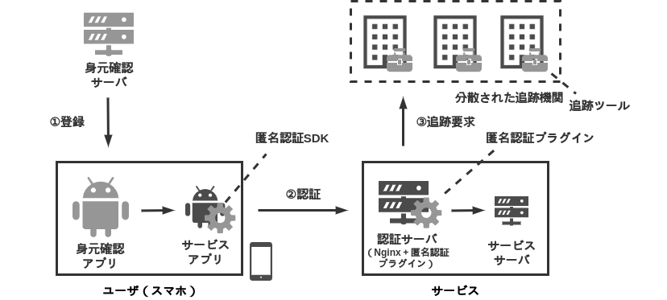

**このページは AIAS の説明ページです．**

## 背景

インターネット上のサービス（e.g., マッチングアプリ，匿名掲示板）において，不正（e.g., 誹謗中傷，サイバー攻撃）が問題となっている．身元確認などを用いて，不正が起きた際に追跡し否認できないようにする方法があるが，ユーザの追跡をできることは，プライバシに関する懸念を与える．

## 目的

インターネット上のサービス（e.g., 匿名掲示板アプリ，マッチングアプリ）において，要件 1-3 を少ない実装コストと運用コストで満たせるようにする．

要件 1 匿名性.
: ユーザは匿名でサービスを利用することができる．

要件 2 追跡可能性.
: ユーザが不正をした場合，サービス側はユーザを追跡できる．

要件 3 否認不可能性.
: ユーザは自身の不正に対し， 否認することができない．

## 課題

フェアブラインド署名方式を用いた認証[1]などの技術はすでに存在しているが，**ユーザが利用する実環境（モバイル環境）で匿名認証を行うための環境が揃っていない**．サービスの提供者が第三者機関と暗号関係のエンジニアを集めて，自力で匿名認証を実装するのは難しいため，サービス上で匿名認証をすることができない．

## 提案

課題 を解決するため，**モバイル向け匿名認証プラットフォーム AIAS(Anonymous Identity Auth Service)を実装・提供**する．
AIAS はサービスに代わって，匿名認証に必要な暗号処理を行うため，サービス提供者は暗号関係の処理を実装する必要がなく，暗号関係のエンジニアがいない多くのサービスで匿名認証を利用できる．

## 仕様

AIAS を以下のソフトウェアと手続きから定義する．

### ソフトウェア

AIAS はサービスアプリ，サービスサーバ，身元確認アプリ，身元確認サーバ，追跡ツールから成り立つ．

サービスアプリ
: ユーザにサービスを提供するモバイルアプリアプリケーションである．認証サーバを通してサービスサーバと通信する．実装対象外．

サービスサーバ
: 認証サーバを通してサービスアプリと通信するサーバである．実装対象外．

身元確認アプリ
: ユーザの身元を eKYC を確認するモバイルアプリケーションである．

身元確認サーバ
: 身元確認アプリから身元のデータ受け取り，フェアブラインド署名方式を用いた証明書を作成する．

匿名認証 SDK
: サービスアプリの向けの匿名認証 SDK である．認証に必要な情報を生成する．

認証サーバ（Nginx）
: サービスサーバの提供者が持つ，認証用のリバースプロキシである．匿名認証プラグインが設定されている．

匿名認証プラグイン
: Nginx 向けの匿名認証を行うプラグインである．

追跡ツール
: 追跡機関の持つツールセットである．署名からユーザを追跡するために必要な情報を生成することができる．

### 手続き

AIAS は参加，認証，追跡の手続きから成り立つ．

参加
: サービスアプリは，身元確認サーバに登録要求する．身元確認アプリは eKYC を用いて身元確認サーバに対して，自身の身元を証明する．身元を証明した後，フェアブラインド署名を用いた署名方式の証明書を発行してサービスアプリを送信する．

認証
: サービスアプリは送りたいデータに対して署名をし，証明書とともにサービスサーバに送信する．サービスサーバは署名と証明書を検証する．

追跡
: サービスサーバの管理者は各追跡機関に対して署名を送信する．追跡機関 は 証明書にあるフェアブラインド署名をもとに， 署名したメンバを特定する．

## 参考

[1] 千田浩司, et al. "代理アクセスを利用した匿名認証方式." 情報処理学会研究報告コンピュータセキュリティ (CSEC) 2005.33 (2004-CSEC-028) (2005): 235-240.
